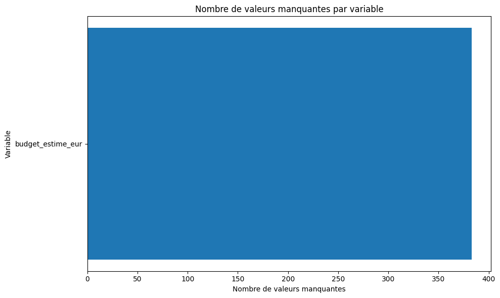
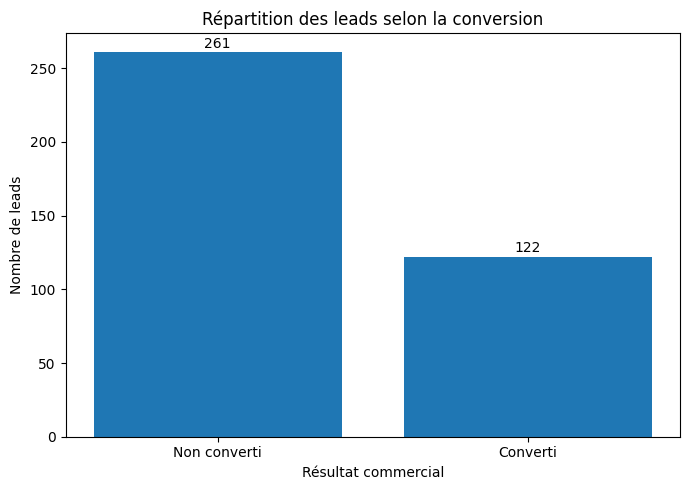
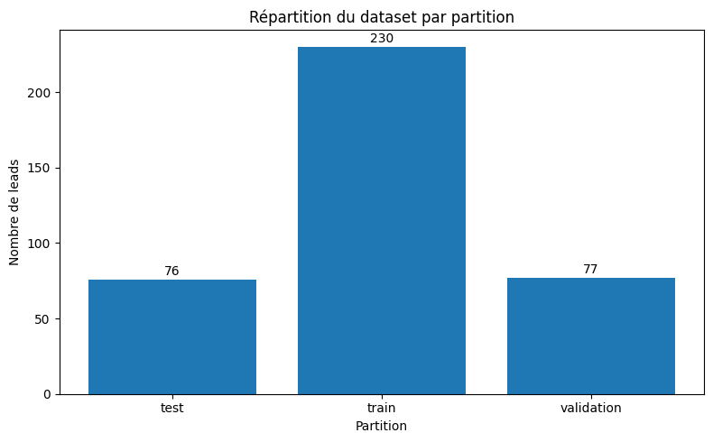
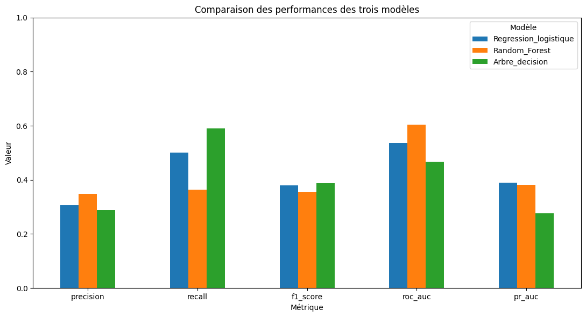
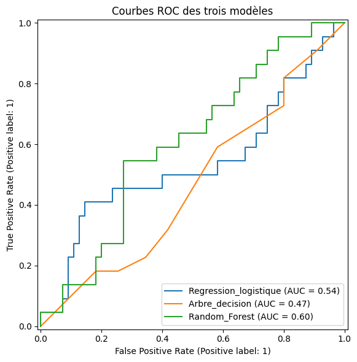
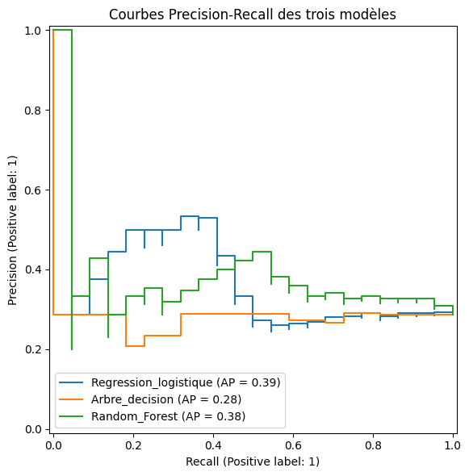
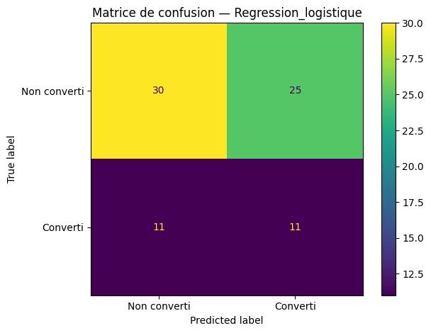
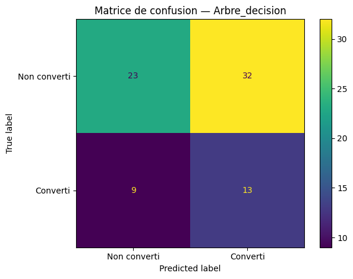
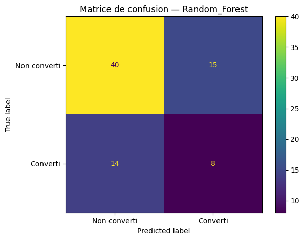
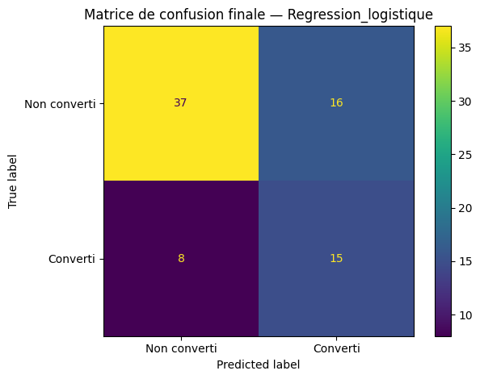

# Prédiction de conversion des leads — Machine Learning sur Databricks

> **Proof of concept de lead scoring orienté métier** dans le secteur de la formation professionnelle : transformer des données de prospection hétérogènes en une probabilité de conversion reproductible afin d’aider les équipes commerciales à prioriser les relances — tout en maintenant la décision humaine et en protégeant les données personnelles ainsi que les informations commerciales sensibles.

[English version](README.md) · [Notebook public](notebooks/lead_conversion_ml_databricks_public.ipynb) · [Model card](docs/model_card.md) · [Dictionnaire public](docs/data_dictionary.md) · [Confidentialité & RGPD](docs/privacy_rgpd.md) · [Reproductibilité](docs/reproducibility.md)

---

## Synthèse exécutive

| Élément | Résultat |
|---|---:|
| Jeu final de modélisation | **383 leads** |
| Leads convertis | **122 (31,85 %)** |
| Leads non convertis | **261 (68,15 %)** |
| Train / validation / test | **230 / 77 / 76** |
| Modèles comparés | Régression logistique, Arbre de décision, Random Forest |
| Modèle retenu | **Régression logistique** |
| ROC-AUC test | **0,704** |
| PR-AUC test | **0,501** |
| Rappel test | **0,652** |
| Précision test | **0,484** |
| F1-score test | **0,556** |
| Accuracy test | **0,684** |
| Taux de conversion du groupe priorisé @ 0,50 | **48,4 %** |
| Taux de conversion de référence sur le test | **30,3 %** |
| Concentration relative des conversions | **≈ 1,6×** |

**Ce que le projet montre :** une méthodologie reproductible peut produire un **signal de classement utile** à partir de données historiques de leads.  
**Ce qu’il ne montre pas encore :** que l’utilisation du score **cause** une hausse du taux de conversion. Cette démonstration exige un pilote prospectif en conditions réelles.

---

# 1. Problématique métier

Une équipe commerciale ne peut pas toujours traiter tous les leads immédiatement ni avec la même intensité. Les prospects diffèrent par leur maturité, leur financement, la formation recherchée, leur engagement et leurs interactions avec les commerciaux, alors que le temps disponible reste limité.

> **Dans quelle mesure un modèle de Machine Learning peut-il améliorer la qualification et la priorisation des leads dans le secteur de la formation professionnelle ?**

L’objectif n’est pas d’automatiser la décision commerciale. Le modèle doit fournir une **probabilité de conversion** permettant d’appuyer un ordre de traitement plus homogène.

Le dispositif doit répondre à quatre questions :

1. Les informations historiques permettent-elles de distinguer des prospects présentant des probabilités de conversion différentes ?
2. Quel modèle offre le meilleur compromis entre qualité de classement, rappel et interprétabilité ?
3. La probabilité prédite peut-elle être traduite en règle de priorisation opérationnelle ?
4. Peut-on présenter cette démarche publiquement sans diffuser de données personnelles ni d’informations commerciales internes sensibles ?

---

# 2. Un projet métier, pas uniquement un exercice de classification

```text
Besoin métier
    ↓
Consolidation des données
    ↓
Règles de qualité
    ↓
Contrôles confidentialité / fuite d'information
    ↓
Préparation des variables
    ↓
Découpage temporel train / validation / test
    ↓
Pipeline commun de prétraitement
    ↓
3 modèles candidats
    ↓
Comparaison sur validation
    ↓
Sélection du modèle
    ↓
Évaluation unique sur test
    ↓
Probabilité → priorisation
    ↓
Pilote opérationnel et monitoring
```

Le résultat final est à la fois un **prototype prédictif** et un **cadre d’aide à la décision** destiné aux équipes marketing et commerciales.

---

# 3. Périmètre public et confidentialité

Le projet original utilise des données internes de prospects. Ce dépôt public ne contient volontairement **aucun export du jeu de données original** ni aucun résultat individuel.

Ne sont pas publiés : noms, prénoms, emails, téléphones, lignes individuelles, scores et classements individuels, performance détaillée par canal/campagne/formation, coefficients détaillés par modalité, nom de table privée Databricks et informations internes du workspace.

Cette stratégie va plus loin que le simple remplacement d’un nom par un numéro : un identifiant pseudonyme peut rester une donnée personnelle si une ré-identification demeure possible.

Le portfolio partage donc **la méthode et les résultats agrégés**, et non un dataset ligne par ligne présenté à tort comme anonyme.

Voir [`docs/privacy_rgpd.md`](docs/privacy_rgpd.md).

---

# 4. Origine et construction des données

La base initiale comportait environ **300 lignes**. Après consolidation, harmonisation et enrichissement, le jeu final utilisé pour l’expérimentation contient **383 leads**.

Une ligne correspond à un lead.

| Famille | Exemples de variables | Rôle |
|---|---|---|
| Temporalité | `annee_inscription`, `mois_inscription` | Contexte temporel |
| Acquisition | `canal_acquisition`, `campagne_base` | Origine du lead |
| Profil | `pays_residence`, `statut_professionnel` | Contexte général du prospect |
| Formation | `categorie_formation`, `format_formation`, `niveau_formation`, `duree_heures` | Formation demandée |
| Financement | `eligible_cpf`, `mode_financement`, `budget_estime_eur` | Contexte de financement |
| Engagement | `formulaire_complete`, `demande_brochure`, `participation_webinaire` | Signaux d’intérêt |
| Interaction commerciale | `reponse_appel`, `rendez_vous`, `nb_relances`, `delai_premier_contact_jours` | Suivi commercial |
| Activité digitale | `nb_clics_annonce`, `nb_visites_site` | Engagement numérique |
| Cible | `conversion` | 1 = converti, 0 = non converti |

Les champs techniques tels que `id_lead`, la date d’inscription et la partition temporelle servent à la traçabilité mais ne sont pas utilisés directement comme entrées prédictives.

---

# 5. Qualité et préparation des données

Le workflow comprend la détection des doublons, l’harmonisation des catégories, la conversion des types, le contrôle de la cible, la normalisation des partitions et l’exclusion des informations connues après l’issue commerciale.

Une limite importante est apparue pendant l’exécution : `budget_estime_eur` était stocké sous forme textuelle et sa conversion numérique a généré **100 % de valeurs manquantes**. Scikit-learn a donc écarté cette variable.



Cette limite est conservée dans le portfolio : une erreur de format réelle ne doit pas être masquée a posteriori.

---

# 6. Répartition de la cible

| Conversion | Leads | Part |
|---|---:|---:|
| Non converti | **261** | **68,15 %** |
| Converti | **122** | **31,85 %** |
| Total | **383** | **100 %** |



L’évaluation ne repose pas uniquement sur l’accuracy. Précision, rappel, F1, ROC-AUC, PR-AUC et matrices de confusion sont également analysés.

Les **faux négatifs** sont particulièrement importants : ce sont des leads réellement convertis que le modèle ne place pas dans le groupe positif au seuil choisi.

---

# 7. EDA interne et limite de publication

Des analyses exploratoires détaillées ont été réalisées en interne par canal d’acquisition, financement, catégorie de formation et campagne.

Leurs valeurs ne sont **pas reproduites** car elles peuvent révéler l’efficacité interne de certaines actions commerciales. Le portfolio se concentre sur la méthodologie et les résultats agrégés nécessaires à l’évaluation du prototype.

---

# 8. Protocole temporel train / validation / test

| Partition | Leads | Conversions | Taux de conversion | Part |
|---|---:|---:|---:|---:|
| Entraînement | **230** | **77** | 33,48 % | 60,1 % |
| Validation | **77** | **22** | 28,57 % | 20,1 % |
| Test | **76** | **23** | 30,26 % | 19,8 % |
| Total | **383** | **122** | 31,85 % | 100 % |



Train sert à ajuster les modèles, validation à les comparer et test à évaluer une seule fois le modèle retenu.

---

# 9. Pipeline de prétraitement

Variables catégorielles :

```text
SimpleImputer(strategy="most_frequent")
        ↓
OneHotEncoder(handle_unknown="ignore")
```

Variables numériques :

```text
SimpleImputer(strategy="median")
        ↓
StandardScaler()
```

Les transformations sont regroupées dans un `ColumnTransformer` puis intégrées avec l’estimateur dans un `Pipeline` scikit-learn.

---

# 10. Modèles comparés

Trois modèles sont évalués dans les mêmes conditions :

- Régression logistique : `solver="liblinear"`, `max_iter=1000`, `class_weight="balanced"`.
- Arbre de décision : `max_depth=4`, `min_samples_leaf=10`, `class_weight="balanced"`.
- Random Forest : `n_estimators=100`, `max_depth=6`, `min_samples_leaf=5`, `max_features="sqrt"`, `class_weight="balanced"`.

L’optimisation reste volontairement limitée afin d’éviter un surajustement à un petit jeu de validation.

---

# 11. Résultats de validation

| Modèle | Accuracy | Précision | Rappel | F1 | ROC-AUC | PR-AUC |
|---|---:|---:|---:|---:|---:|---:|
| Régression logistique | 0,532 | 0,306 | **0,500** | 0,379 | 0,537 | **0,389** |
| Random Forest | **0,623** | **0,348** | 0,364 | 0,356 | **0,604** | 0,382 |
| Arbre de décision | 0,468 | 0,289 | **0,591** | **0,388** | 0,467 | 0,277 |



Aucun modèle ne domine toutes les métriques. La Random Forest domine sur accuracy et ROC-AUC, l’arbre sur rappel/F1, et la régression logistique sur PR-AUC avec un rappel supérieur à celui de la Random Forest.

---

# 12. Courbes ROC et Precision–Recall



ROC-AUC validation : Random Forest **0,604**, Régression logistique **0,537**, Arbre **0,467**.



PR-AUC validation : Régression logistique **0,389**, Random Forest **0,382**, Arbre **0,277**.

---

# 13. Matrices de confusion sur validation

## Régression logistique



VN=30 · FP=25 · FN=11 · VP=11.

## Arbre de décision



VN=23 · FP=32 · FN=9 · VP=13.

## Random Forest



VN=40 · FP=15 · FN=14 · VP=8.

---

# 14. Pourquoi retenir la régression logistique ?

Le modèle retenu est la **régression logistique** pour le compromis suivant : meilleure PR-AUC de validation (**0,389**), rappel **0,500** supérieur à la Random Forest, probabilité directement utilisable comme score et modèle plus simple à expliquer.

Ce choix est propre au contexte du prototype.

---

# 15. Réentraînement final

Après sélection :

```text
Train + Validation = 230 + 77 = 307 leads
```

Le modèle est réentraîné sur ces 307 observations puis évalué une seule fois sur **76 leads de test**.

---

# 16. Performance finale sur le test

| Métrique | Résultat |
|---|---:|
| Accuracy | **0,684** |
| Précision | **0,484** |
| Rappel | **0,652** |
| F1-score | **0,556** |
| ROC-AUC | **0,704** |
| PR-AUC | **0,501** |

Ces métriques restent sensibles à la petite taille du test.

---

# 17. Matrice de confusion finale



| | Prédit non converti | Prédit converti |
|---|---:|---:|
| Réel non converti | **37** | **16** |
| Réel converti | **8** | **15** |

Le modèle retrouve **15 conversions sur 23**. Les **8 faux négatifs** sont des conversions réelles non détectées au seuil 0,50.

---

# 18. Traduction métier

Sur le test :

- taux de conversion global : **23/76 = 30,3 %** ;
- leads classés positifs à 0,50 : **31** ;
- conversions dans ce groupe : **15** ;
- taux de conversion du groupe positif : **48,4 %** ;
- concentration relative : **≈ 1,6×** ;
- rappel : **65,2 %**.

| Indicateur | Valeur |
|---|---:|
| Taux de conversion test | **30,3 %** |
| Leads positifs | **31** |
| Conversions dans le groupe positif | **15** |
| Taux de conversion du groupe positif | **48,4 %** |
| Lift relatif | **≈ 1,6×** |
| Rappel | **65,2 %** |

Le score concentre davantage de conversions historiques dans le groupe priorisé. Il s’agit d’une preuve de **capacité de classement**, pas d’une preuve causale d’augmentation des ventes.

---

# 19. Le seuil comme paramètre métier

Un seuil plus bas augmente généralement le rappel mais aussi la charge commerciale. Un seuil plus élevé réduit le volume à traiter mais augmente le risque de manquer des conversions.

Le seuil doit donc être choisi selon la capacité de traitement, le coût des faux négatifs, le coût des faux positifs et la valeur moyenne des opportunités.

---

# 20. Human-in-the-loop

```text
Informations du lead
      ↓
Probabilité du modèle
      ↓
Ordre / priorité
      ↓
Revue humaine
      ↓
Décision de contact / relance
```

Le prototype n’a pas vocation à rejeter automatiquement un prospect.

---

# 21. RGPD et privacy by design

Le dépôt adopte une politique de minimisation : aucun enregistrement original, identifiant direct, score individuel ni classement n’est publié.

Un `id_lead` technique utilisé en interne n’est pas considéré comme anonyme par défaut. Les valeurs ligne par ligne des variables de profil et de comportement restent hors GitHub.

Les résultats commerciaux détaillés par canal/campagne et les poids détaillés des modalités sont également confidentiels.

Voir [`docs/privacy_rgpd.md`](docs/privacy_rgpd.md).

---

# 22. Limites

1. 383 observations seulement.
2. Validation/test de 77 et 76 leads.
3. `budget_estime_eur` inutilisable dans cette exécution.
4. Seuil 0,50 non calibré sur un coût métier mesuré.
5. Optimisation d’hyperparamètres limitée.
6. Relations prédictives et non causales.
7. Pas encore de pilote prospectif démontrant l’impact métier.
8. Risque de dérive des données et comportements.
9. Performance par sous-groupes et équité à contrôler avant un déploiement réel.

---

# 23. Pilote opérationnel recommandé

Comparer le processus commercial de référence avec un processus assisté par le score, en définissant les règles avant d’observer les résultats.

Indicateurs métier : taux de conversion, délai de premier contact, nombre de relances, part de leads traités, conversions par temps commercial si disponible.

Indicateurs modèle : précision, rappel, PR-AUC, calibration, faux négatifs, dérive de la distribution des scores.

Indicateurs qualité : valeurs manquantes, doublons, dérive des catégories et erreurs de format.

---

# 24. Stack technique

| Couche | Technologie |
|---|---|
| Environnement / traçabilité | Databricks |
| Accès aux données | Table Databricks → Pandas |
| Manipulation | Python, Pandas, NumPy |
| Prétraitement | scikit-learn `Pipeline`, `ColumnTransformer` |
| Encodage | `OneHotEncoder` |
| Préparation numérique | `SimpleImputer`, `StandardScaler` |
| Modèles | Logistic Regression, Decision Tree, Random Forest |
| Évaluation | scikit-learn |
| Visualisation | Matplotlib |

Le projet n’est pas présenté comme une architecture Big Data distribuée : avec 383 lignes, une modélisation PySpark aurait ajouté de la complexité sans valeur analytique.

---

# 25. Structure du dépôt

```text
lead-conversion-ml-databricks/
├── README.md
├── README_FR.md
├── requirements.txt
├── .gitignore
├── assets/
├── notebooks/
│   └── lead_conversion_ml_databricks_public.ipynb
├── results/
├── data/
│   └── README.md
└── docs/
    ├── data_dictionary.md
    ├── model_card.md
    ├── privacy_rgpd.md
    └── reproducibility.md
```

---

# 26. Reproductibilité

Le dépôt fournit une **reproductibilité méthodologique** : le notebook, le schéma et les résultats agrégés sont documentés, mais le dataset original n’est pas distribué.

Pour rejouer l’expérience dans un environnement autorisé : fournir une table conforme, conserver les identifiants hors modèle, maintenir les partitions temporelles, appliquer le pipeline commun, sélectionner sur validation, évaluer test une seule fois puis valider le seuil sur de nouvelles cohortes.

---

# 27. Points clés

1. **La préparation de la donnée a été plus importante que la sophistication algorithmique.**
2. **Aucun modèle ne domine toutes les métriques.**
3. **La régression logistique est retenue pour le compromis PR-AUC / rappel / interprétabilité.**
4. **Sur test : ROC-AUC 0,704, PR-AUC 0,501, rappel 0,652.**
5. **Le groupe positif atteint 48,4 % de conversion contre 30,3 % en moyenne, soit ≈ 1,6×.**
6. **C’est un signal de classement, pas une preuve causale de gain commercial.**
7. **Le score doit assister la priorisation humaine, pas exclure automatiquement des prospects.**
8. **Les données personnelles, scores individuels et performances commerciales détaillées restent hors du dépôt public.**

---

## Note de publication

Ce dépôt est une représentation portfolio d’un projet de thèse professionnelle. Il expose la méthode et les résultats agrégés utiles, tout en conservant hors GitHub les données originales et les sorties opérationnelles confidentielles.